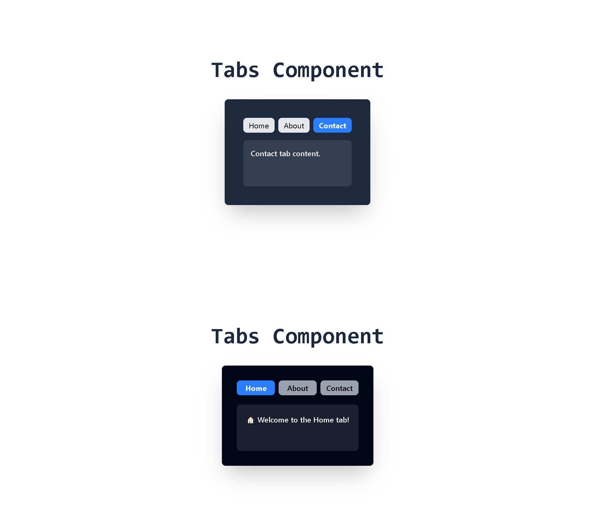

# 🏷️ React Tabs Component Project

This project demonstrates **two implementations** of a Tabs component using **React and Tailwind CSS**:

1. **BasicTab** – A simple tabs implementation with fixed "Home, About, Contact" tabs.
2. **Tabs** – A **reusable and dynamic tabs component** that accepts tab data (label + content) as props, making it more flexible and scalable.

---

## Tabs Components (Resuable) Hammad



---

## 📌 Features

- ✅ Switch between multiple tabs (Home, About, Contact, etc.)
- ✅ Styled with **Tailwind CSS** for a modern UI
- ✅ Two versions included:
  - **Basic Tab:** Hardcoded example with fixed tabs.
  - **Reusable Tabs:** Accepts `tabs` prop for dynamic tab rendering.
- ✅ Responsive & minimal design
- ✅ Beginner-friendly project to understand **React state management**

---

## 🛠️ Tech Stack

- ⚛️ **React** – UI library
- 🎨 **Tailwind CSS** – Styling framework
- 🖥️ **Vite / CRA** – Development setup (depending on your setup)

---

## 📂 Folder Structure

react-tabs-project/
│
├── src/
│ ├── App.js
│ ├── components/
│ │ ├── BasicTab.jsx
│ │ ├── Tabs.jsx
│ ├── index.css
│ └── main.jsx
│
├── package.json
├── tailwind.config.js
└── README.md

---

## 🚀 Getting Started

Follow these steps to run the project locally:

### 1️⃣ Clone the repo

```bash
git clone https://github.com/your-username/react-tabs-project.git
cd react-tabs-project

2️⃣ Install dependencies
npm install

3️⃣ Run the project
npm run dev

4️⃣ Open in browser

Visit 👉 http://localhost:5173

```

---
